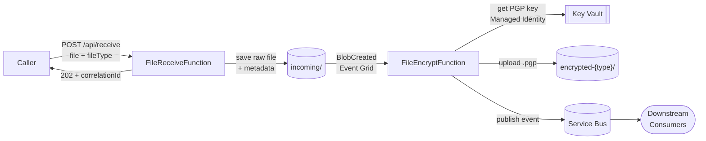

# Encryption Function App

[](https://github.com/tonyjoanes/encryption/actions/workflows/ci.yml)

An Azure Function App that receives CSV files, encrypts them with PGP, stores the encrypted output in Blob Storage, and publishes a metadata event to Service Bus for downstream consumers.

---

## How it works



The receive and encrypt stages are decoupled — the HTTP caller gets a fast **202 Accepted** response, and if encryption fails the raw file stays in `incoming/` for automatic retry via Event Grid.

See [`docs/architecture.md`](docs/architecture.md) for the full architecture and sequence diagrams.

---

## Tech stack

| Concern | Choice |
|---|---|
| Runtime | .NET 8 · Azure Functions v4 isolated worker |
| Encryption | PGP / OpenPGP via [PgpCore](https://github.com/mattosaurus/PgpCore) |
| Storage | Azure Blob Storage (Managed Identity) |
| Messaging | Azure Service Bus (Managed Identity) |
| Secrets | Azure Key Vault (PGP public key) |
| Infrastructure | Bicep |
| Observability | Application Insights + Log Analytics |
| Tests | xUnit · Moq · FluentAssertions |

---

## Prerequisites

- [.NET 8 SDK](https://dotnet.microsoft.com/download/dotnet/8)
- [Azure Functions Core Tools v4](https://learn.microsoft.com/azure/azure-functions/functions-run-local)
- [Azure CLI](https://learn.microsoft.com/cli/azure/install-azure-cli) with Bicep (`az bicep install`)
- An Azure subscription with a resource group ready
- `az login` completed

---

## Local development

1. **Clone and restore**
   ```bash
   git clone https://github.com/tonyjoanes/encryption.git
   cd encryption
   dotnet restore EncryptionFunctionApp.sln
   ```

2. **Configure local settings** — copy the template and fill in your dev Azure resource names:
   ```bash
   cp src/EncryptionFunctionApp/local.settings.json.example \
      src/EncryptionFunctionApp/local.settings.json
   # Edit local.settings.json with your dev storage account, service bus, and key vault URIs.
   ```
   `local.settings.json` is git-ignored and never committed.

3. **Add the PGP public key to Key Vault**
   ```bash
   az keyvault secret set \
     --vault-name <your-dev-keyvault> \
     --name pgp-public-key \
     --file path/to/public.asc
   ```

4. **Start the function app**
   ```bash
   cd src/EncryptionFunctionApp
   func start
   ```

5. **Send a test request**
   ```bash
   curl -X POST "http://localhost:7071/api/receive?code=<local-key>" \
     -F "fileType=members" \
     -F "file=@test.csv;filename=test.csv"
   # → 202 { "correlationId": "..." }
   ```

6. **Check health**
   ```bash
   curl http://localhost:7071/api/health
   # → 200 { "status": "healthy" }
   ```

---

## Running tests

```bash
# All tests
dotnet test EncryptionFunctionApp.sln

# With detailed output
dotnet test EncryptionFunctionApp.sln --verbosity normal

# With code coverage
dotnet test EncryptionFunctionApp.sln --collect:"XPlat Code Coverage"
```

The test suite uses real PGP key generation for encryption tests (via `PgpKeyFixture`) — no Azure resources are needed to run tests.

---

## Deploying to Azure

```bash
# 1. Deploy infrastructure
az deployment group create \
  --resource-group <your-rg> \
  --template-file iac/main.bicep \
  --parameters iac/main.bicepparam \
  --parameters pgpPublicKey="$(cat path/to/public.asc)"

# 2. Publish the function app
dotnet publish src/EncryptionFunctionApp/EncryptionFunctionApp.csproj \
  --configuration Release --output ./publish

cd publish && zip -r ../deploy.zip .

az functionapp deployment source config-zip \
  --resource-group <your-rg> \
  --name <function-app-name> \
  --src ../deploy.zip
```

Bicep provisions everything automatically: Storage Account, Key Vault, Service Bus, Event Grid, Application Insights, and all Managed Identity role assignments.

---

## Adding a new file type

1. **`src/EncryptionFunctionApp/Constants/FileTypes.cs`** — add a constant and include it in `All`:
   ```csharp
   public const string Invoices = "invoices";

   public static readonly IReadOnlySet<string> All =
       new HashSet<string>(StringComparer.OrdinalIgnoreCase)
       {
           Members, Addresses, Invoices,   // ← add here
       };
   ```

2. **`iac/main.bicepparam`** — add the type to the array:
   ```bicep
   param fileTypes = ['members', 'addresses', 'invoices']
   ```

3. Re-deploy Bicep — the `encrypted-invoices` container is created automatically.

No function code, trigger, or Service Bus changes required.

---

## Project structure

```
.
├── EncryptionFunctionApp.sln
├── src/
│   └── EncryptionFunctionApp/         # Azure Function App (.NET 8 isolated)
│       ├── Constants/FileTypes.cs     # Extensibility point for file types
│       ├── Functions/                 # HTTP + blob trigger functions
│       ├── Models/                    # Event and metadata records
│       └── Services/                  # PGP, Blob Storage, Service Bus
├── tests/
│   └── EncryptionFunctionApp.Tests/   # xUnit test project (66 tests)
│       ├── Fixtures/                  # PgpKeyFixture (real key pair)
│       ├── Helpers/                   # HttpRequestBuilder, AzureSdkMockFactory
│       ├── Functions/                 # Function tests
│       ├── Services/                  # Service tests
│       └── Constants/                 # FileTypes tests
├── iac/                               # Bicep infrastructure
│   ├── main.bicep
│   ├── main.bicepparam
│   └── modules/                       # storage, keyvault, servicebus, eventgrid, functionapp, monitoring
└── docs/
    └── architecture.md                # Architecture + sequence diagrams (Mermaid)
```
