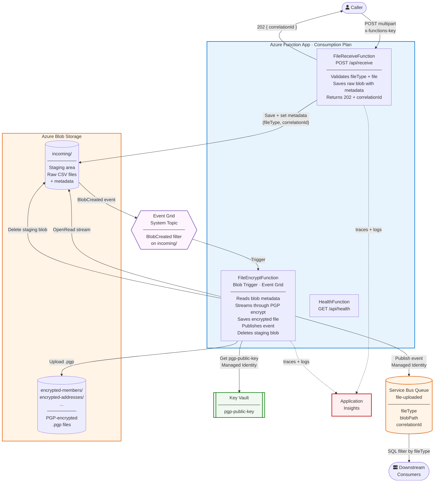
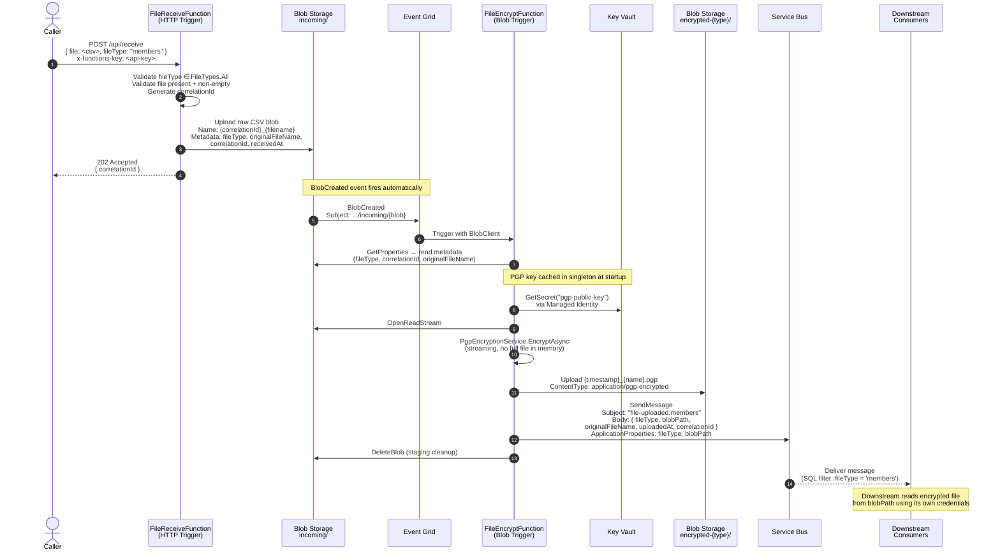

# Architecture

## Overview

A two-stage Azure Function pipeline that receives CSV files, encrypts them with PGP, stores the encrypted output in Blob Storage, and publishes a metadata event to Service Bus for downstream consumers.

The receive and encrypt stages are deliberately decoupled: the HTTP caller gets a fast 202 response and the raw file is safe in blob storage even if the encryption step later fails.

---

## Architecture Diagram

---

## Sequence Diagram

---

## Azure Resources

| Resource | SKU | Purpose |
|---|---|---|
| Function App | Consumption (Y1) | Hosts FileReceiveFunction, FileEncryptFunction, HealthFunction |
| App Service Plan | Dynamic | Scales to zero when idle |
| Storage Account | Standard LRS | `incoming/` staging container + `encrypted-{type}/` output containers |
| Key Vault | Standard, RBAC | Holds `pgp-public-key` secret; accessed via Managed Identity |
| Service Bus Namespace | Standard | `file-uploaded` queue with DLQ, 14-day TTL, 10 max deliveries |
| Event Grid System Topic | — | Scoped to Storage Account; routes `BlobCreated` events from `incoming/` |
| Application Insights | — | Distributed tracing; all logs include `CorrelationId` and `FileType` |
| Log Analytics Workspace | PerGB2018, 30d | Backend for Application Insights |

## Security (WAF)

All Azure resource connections use **Managed Identity** — no connection strings or secrets in app settings.

| Role | Assigned to | Scope |
|---|---|---|
| Storage Blob Data Contributor | Function App MI | Storage Account |
| Azure Service Bus Data Sender | Function App MI | Service Bus Namespace |
| Key Vault Secrets User | Function App MI | Key Vault |

## Extensibility

Adding a new file type (e.g. `invoices`) requires changes in exactly two places:

1. **`src/EncryptionFunctionApp/Constants/FileTypes.cs`** — add constant + include in `All` set
2. **`iac/main.bicepparam`** — add `"invoices"` to the `fileTypes` array

Re-deploying Bicep creates the `encrypted-invoices` container. No trigger, function, or Service Bus changes are needed.
